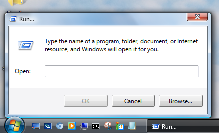

# Installation

## TABLE OF CONTENTS

1. [Prerequisites](#preq)
2. [Plasma components](#plasma)
3. [Compiling](#compile)
4. [KWin components](#kwin)
5. [Miscellaneous components](#misc)
6. [Configuring VistaThemePlasma](#conf)
7. [Extras](#extras)

## Prerequisites <a name="preq"></a>

**NOTE**: Dependencies for other disros besides Arch Linux have been provided by contributors and aren't updated frequently, which may result in incorrect or missing dependencies.

### Arch Linux
Required packages:

```bash
pacman -S cmake extra-cmake-modules ninja qt6-virtualkeyboard qt6-multimedia qt6-5compat plasma-wayland-protocols plasma5support kvantum base-devel
```

### Note:

Since Plasma 6.4, the X11 session has been separated from the main codebase. On Arch Linux, additional dependencies for X11 include:

- `kwin-x11`
- `plasma-x11-session`

KSysGuard has been officially deprecated by KDE, however an unofficial [port](https://github.com/zvova7890/ksysguard6) exists for Qt6, which can be installed using the [AUR](https://aur.archlinux.org/packages/ksysguard6-git) package on Arch-based distros.

### Fedora KDE
Required Packages:

```bash
dnf install plasma-workspace-devel kvantum qt6-qtmultimedia-devel qt6-qt5compat-devel libplasma-devel qt6-qtbase-devel qt6-qtwayland-devel plasma-activities-devel kf6-kpackage-devel kf6-kglobalaccel-devel qt6-qtsvg-devel wayland-devel plasma-wayland-protocols kf6-ksvg-devel kf6-kcrash-devel kf6-kguiaddons-devel kf6-kcmutils-devel kf6-kio-devel kdecoration-devel kf6-ki18n-devel kf6-knotifications-devel kf6-kirigami-devel kf6-kiconthemes-devel cmake gmp-ecm-devel kf5-plasma-devel libepoxy-devel kwin-devel kf6-karchive kf6-karchive-devel plasma-wayland-protocols-devel qt6-qtbase-private-devel qt6-qtbase-devel kf6-knewstuff-devel kf6-knotifyconfig-devel kf6-attica-devel kf6-krunner-devel kf6-kdbusaddons-devel kf6-sonnet-devel plasma5support-devel plasma-activities-stats-devel polkit-qt6-1-devel qt-devel
```

## Compiling <a name="compile"></a>

To build the components that need to be compiled (KWin effects, Decoration theme, etc.), run ```compile.sh```:

```bash
$ chmod +x compile.sh && ./compile.sh
```

or

```bash
$ sh compile.sh
```

## Note for Wayland users:

The compile script must be run while passing the `--wayland` argument for KWin effects:

```bash
$ ./compile.sh --wayland
$ sh compile.sh --wayland # Or like this
```

If compiling individual KWin effects by running their respective `install.sh` or `install_ninja.sh`, you can also pass the `--wayland` argument there:

```bash
$ ./install_ninja.sh --wayland
$ sh install_ninja.sh --wayland # Or like this
```

## Plasma components <a name="plasma"></a>

### Install scripts

1. Run the following scripts:
```bash
$ chmod +x install_plasmoids.sh && ./install_plasmoids.sh
$ chmod +x install_plasma_components.sh && ./install_plasma_components.sh # Requires authorization for SMOD resources and SDDM themes
```

### Manual

This section relates to the directories found in the ```plasma``` folder.

1. Move the ```smod``` folder to ```~/.local/share```, or ```/usr/share/``` for a system-wide installation. This will install the resources required by many other components in this project.

2. Move the folders ```desktoptheme```, ```look-and-feel```, ```plasmoids```, ```layout-templates```, ```shells``` into ```~/.local/share/plasma```. If the folder doesn't exist, create it. These folders contain the following:
    - Plasma Style
    - Global Theme
    - Plasmoids
    - Plasma shell
    - Preset panel layout that can be applied from Edit mode
    
Make sure to compile the C++ components of plasmoids located in ```plasmoids/src/``` by running ```install.sh``` for every source folder. You can also use ```install_ninja.sh``` to build using Ninja.

3. Move ```sddm-theme-mod``` to ```/usr/share/sddm/themes```.
4. Import and apply the color scheme through System Settings. 

## KWin components <a name="kwin"></a>

### Install scripts

1. Run the following script:
```bash
$ chmod +x install_kwin_components.sh && ./install_kwin_components.sh 
```

### Manual 

This section relates to the directories found in the ```kwin``` folder.

1. Move ```effects```, ```tabbox```, ```outline```, ```scripts``` to ```~/.local/share/kwin```.
2. In System Settings, apply the following settings: 
- In Window Behavior -> Titlebar Actions: 
    - Mouse wheel: Do nothing
- In Window Behavior -> Task Switcher:
    - Main: Thumbnail Seven, Include "Show Desktop" entry
    - Alternative: Flip Switch, Forward shortcut: Meta+Tab
- In Window Behavior -> Desktop Effects, enable the following: 
    - Aero Glass Blur
    - Aero Glide
    - Desaturate Unresponsive Applications
    - Fading Popups
    - Login
    - SMOD Glow
    - SMOD Snap
    - Squash
    - Scale
    - Dim Screen for Administrator Mode
- In Window Behavior -> Desktop Effects, **disable** the following: 
    - Background Contrast
    - Blur
    - Maximize
    - Sliding Popups
    - Dialog Parent
    - Dim Inactive
    - Logout

## Miscellaneous components <a name="misc"></a>

### Install scripts

1. Run the following script:
```bash
$ chmod +x install_misc_components.sh && ./install_misc_components.sh 
```

This section relates to the directories found in the ```misc``` folder.

1. Move the ```Kvantum``` folder (the one inside the ```kvantum``` folder) to ```~/.config```, then in Kvantum Manager select the theme.
2. Unpack the sound archive and move the folders to ```~/.local/share/sounds```, then select the sound theme in System Settings.
3. Unpack the icon archive and move the folder to ```~/.local/share/icons```, then select the icon theme in System Settings.
4. Unpack the cursor archive and move the folder to ```/usr/share/icons```, then follow [this](https://www.youtube.com/watch?v=Dj7co2R7RKw) guide to install the cursor theme. 
5. Move the files located in ```mimetype``` into ```~/.local/share/mime/packages``` and then run ```update-mime-database ~/.local/share/mime``` to fix DLLs and EXE files sharing the same icons.
6. Segoe UI, Segoe UI Bold, and Segoe UI Italic are required for this theme and they should be installed as system-wide fonts.
7. Optionally, to install custom branding at the Info Center, move ```kcm-about-distrorc``` from the ```branding``` folder to ```~/.config/kdedefaults/```, then edit the file's ```LogoPath``` entry to point to the absolute path of ```kcminfo.png```.
8. Optionally, install the [Plymouth theme](https://github.com/furkrn/PlymouthVista). This theme requires Lucida Console and Segoe UI installed as a system-wide font.

If SDDM fails to pick up on the cursor theme, go to System Settings -> Startup and Shutdown -> Login Screen (SDDM), and click on Apply Plasma Settings to enforce your current cursor theme, and other relevant settings. Do this *after* installing everything else. If even that fails, change the default cursor theme in ```/usr/share/icons/default/index.theme``` to say ```aero-drop```.

## Configuring VistaThemePlasma <a name="conf"></a>

1. After installing everything, restart KDE Plasma and KWin (you can do so by running ```plasmashell --replace & disown``` and ```kwin_x11 --replace & disown``` (only works for X11) in a terminal)
2. On a fresh KDE install, **remove** the default panel and add the "VistaThemePlasma Taskbar" panel using Edit mode. You can also manually configure the panel for a finer setup.
3. Right click on the desktop and open "Desktop and Wallpaper", and select "Vista Desktop" under Layout, and apply the changes.
4. Disable the following entries in the system tray settings:
    - Audio Volume
    - Power and Battery 
    - Notifications
    - Networks 
    - Keyboard Layout
    
   And enable the following entries: 
    - Volume Mixer
    - Battery 
    - Action Center
    - Network (Vista)
5. When updating KDE Plasma, usually through a full system upgrade, recompiling KWin effects and the DefaultToolTip component is necessary.
6. In System Settings -> Session -> Desktop Session, uncheck the "Ask for confirmation" option.
7. In System Settings -> Keyboard -> Shortcuts, under KWin, disable the "Peek at Desktop" shortcut, and remap the "MinimizeAll" to Meta+D
8. In System Settings -> Fonts, configure the fonts as shown here:


9. To add the gadgets sidebar, drag and drop the "Windows Sidebar" plasmoid from the "Add Widgets" menu into the desktop.

The following steps are optional: 

10. To enable full font hinting just for Segoe UI, move the ```fontconfig``` folder to ```~/.config```. This will enable full font hinting for Segoe UI while keeping slight font hinting for other fonts. Additionally, append ```QML_DISABLE_DISTANCEFIELD=1``` into ```/etc/environment``` in order for this to be properly applied. *While full font hinting makes the font rendering look sharper and somewhat closer to Windows 7's ClearType, on Linux this option causes noticeably faulty kerning. This has been a [prominent](https://github.com/OpenTTD/OpenTTD/issues/11765) [issue](https://gitlab.gnome.org/GNOME/pango/-/issues/656) [for](https://gitlab.gnome.org/GNOME/pango/-/issues/463) [several](https://gitlab.gnome.org/GNOME/pango/-/issues/404) [years](https://github.com/harfbuzz/harfbuzz/issues/2394) [now](https://www.phoronix.com/news/HarfBuzz-Hinting-Woe) and while the situation has improved from being unreadable to just being ugly, a complete solution for this doesn't seem to be coming anytime soon.*
11. For Wine users it's recommended to install the [VistaVG Ultimate](https://www.deviantart.com/vishal-gupta/art/VistaVG-Ultimate-57715902) msstyles theme.
12. Add the following to ```~/.bashrc``` to get bash to look more like the command prompt on Windows:

```
PS1='C:${PWD//\//\\\\}> '

echo -e "Microsoft Windows [Version 6.0.6003]\nCopyright (c) 2006 Microsoft Corporation.  All rights reserved.\n"
```

13. In the terminal emulator of your choice (e.g Konsole), set the font to [TerminalVector](https://www.yohng.com/software/terminalvector.html), size 9pt. Disable smooth font rendering and bold text, reduce the line spacing and margins to 0px, set the cursor shape to underline, and enable cursor blinking.

## Extras <a name="extras"></a>

This section relates to the directories found inside the ``extras`` folder and is completely optional.

### Extra components

**Execute Binary** 

Application written in QtWidgets that's meant to replicate Windows's run dialog.



**Installation**

1. Run the install script. The program will get installed to ``/usr/bin/execbin``
2. Optionally, make a shortcut for ``execbin`` inside system settings


**UAC-like Polkit** 

KDE Polkit Agent modification to make it look more like Windows' UAC dialog.


**Installation**

1. Navigate to the ```uac-polkitagent``` folder, and run ```install.sh``` (or ```install_ninja.sh``` if you have Ninja installed):

```bash
$ chmod +x install.sh && ./install.sh
```

2. To remove the minimize and maximize buttons from the window, run ```add_rule.sh``` which will generate the appropriate KWin rule: 

```bash
$ chmod +x add_rule.sh && ./add_rule.sh
```
