# VISTATHEMEPLASMA FOR KDE 6

## Microsoft® Windows™ is a registered trademark of Microsoft® Corporation. This name is used for referential use only, and does not aim to usurp copyrights from Microsoft. Microsoft Ⓒ 2025 All rights reserved. All resources belong to Microsoft Corporation.

## Introduction

This is a fork of [WackyIdeas](https://gitgud.io/wackyideas/)' [AeroThemePlasma](https://gitgud.io/wackyideas/aerothemeplasma) which aims to recreate the look and feel of Windows Vista as much as possible on KDE Plasma, whilst adapting the design to fit in with modern features provided by KDE Plasma and Linux.

VTP is in constant development and testing. So far it has been tested on:

1. Arch Linux x64 and other Arch derivatives
2. Plasma 6.5.4, KDE Frameworks 6.20.0, Qt 6.10.1
3. 96 DPI scaling, single monitor
4. X11, Wayland*

*VistaThemePlasma currently lacks full Wayland support, which may result in Wayland-specific issues. 

## This project overwrites a small number of [system](https://gitgud.io/catpswin56/vistathemeplasma/-/tree/master/misc/libplasma) [files](https://gitgud.io/catpswin56/vistathemeplasma/-/tree/master/extras/extra-components/uac-polkitagent), it's always recommended to make backups of your system just in case. I am not responsible for broken systems, please proceed with caution.

[GitHub mirror](https://github.com/catpswin5/vistathemeplasma)

## Installation

See [INSTALL.md](./INSTALL.md) for a quick install guide.

For the sidebar gadgets, go [here](https://gitgud.io/catpswin56/win-gadgets).

## Credits 

Many thanks to the people who helped out by testing and providing some suggestions for certain plasmoids and other stuff. Special thanks goes to [WackyIdeas](https://gitgud.io/wackyideas/) for making the original [AeroThemePlasma](https://gitgud.io/wackyideas/aerothemeplasma) theme.

### Contributors

- [AngelBruni](https://github.com/angelbruni) for the SVG Vista taskbar texture
- [ThePhantom](https://github.com/ThePhantom6314) for remaking the task item textures and power button glyphs in SVG
- [aeoe](https://gitgud.io/aeoe) for fixing a minor issue with the VistaStart dialog texture
- [furkrn](https://gitgud.io/furkrn) for creating and maintaining the [Plymouth theme](https://github.com/furkrn/PlymouthVista)
- [xodus2002](https://github.com/xodus2002) for the Glass, Pearl and Tinker sound themes from Windows Ultimate Extras

### Very Cool projects that you should check out

- [Geckium](https://github.com/angelbruni/Geckium) by AngelBruni
- [Aero UserChrome](https://gitgud.io/souris/aero-userchrome) by Souris (Geckium in combination with Aero UserChrome works well with AeroThemePlasma and VistaThemePlasma)
- [AeroThemePlasma](https://gitgud.io/wackyideas/aerothemeplasma/) by [WackyIdeas](https://gitgud.io/wackyideas)
- [Ice2K.sys](https://toiletflusher.neocities.org/ice2k/) by 0penrc
- [Sevulet](https://gitgud.io/snailatte/sevulet) by [snailatte](https://gitgud.io/snailatte)

## Screenshots

### Desktop

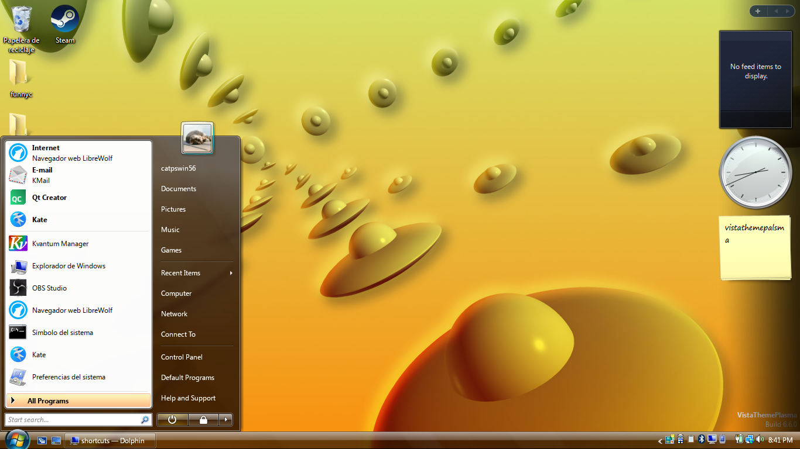

### Start Menu

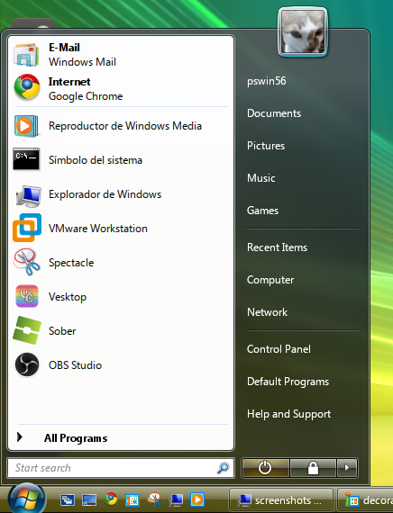
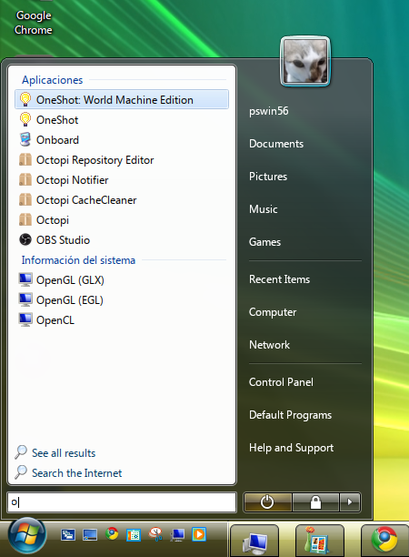
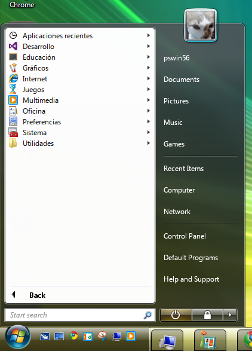
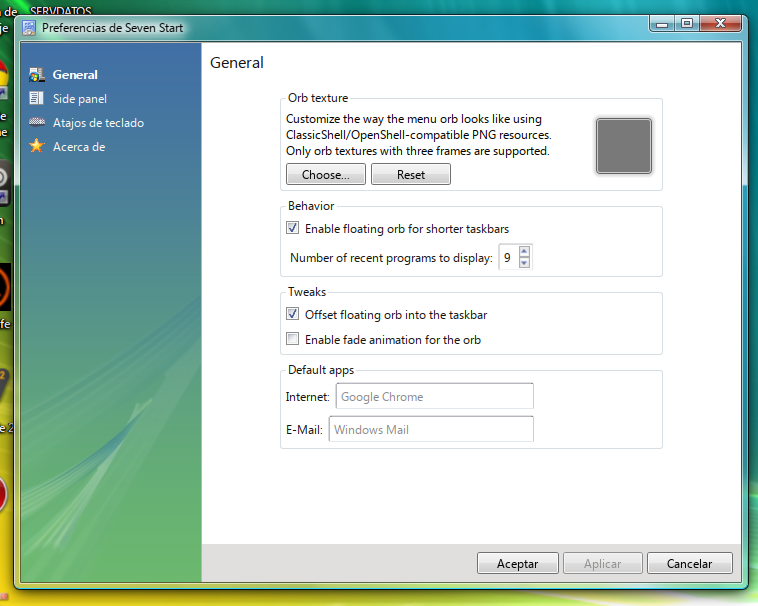

### Clock

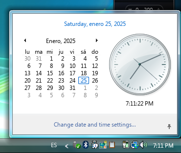

### System Tray

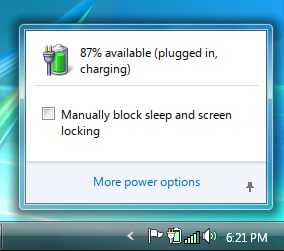
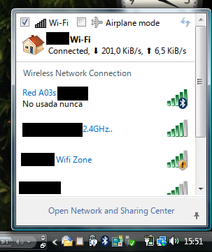
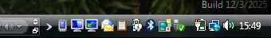

### Sound Mixer

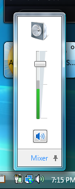
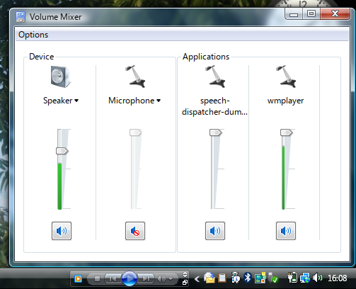

### Notifications 

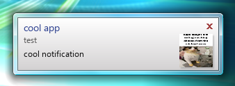
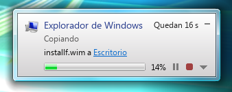

### Desktop Icons 

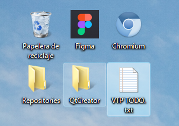

### Lockscreen 

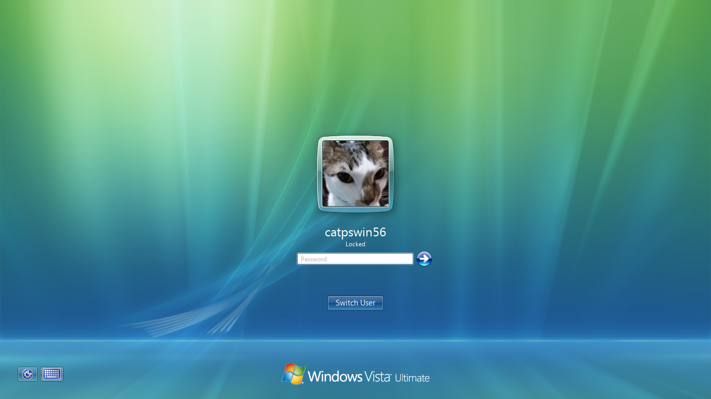

### Alt-Tab Switcher

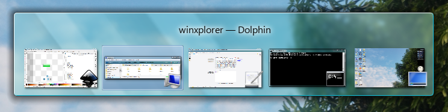

### Colorization 

Regular colorization:

Basic colorization:

Maximized opaque colorization:
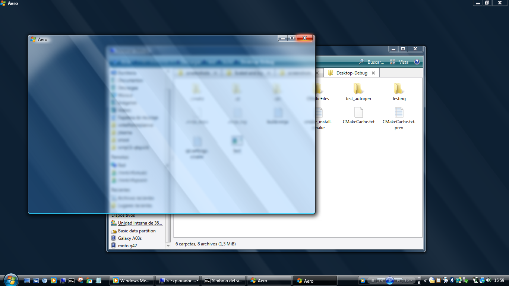

### Decorations

### Gadgets 

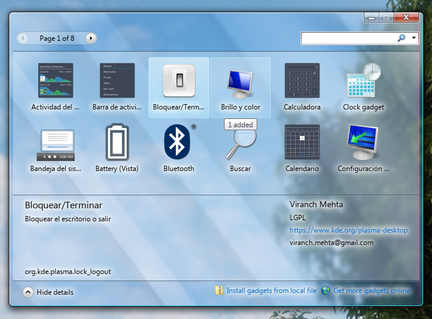

### Floorp

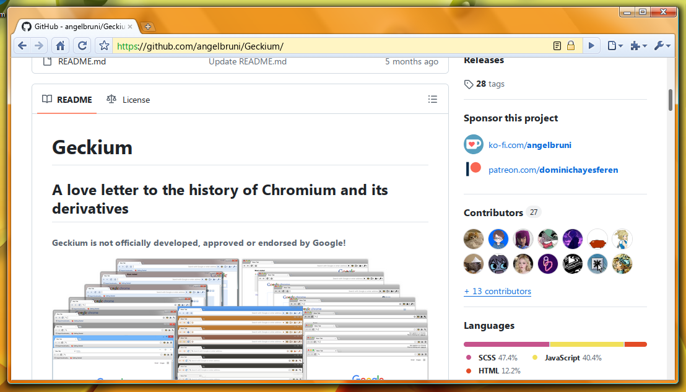

### Taskbar

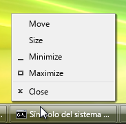
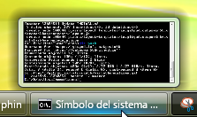
