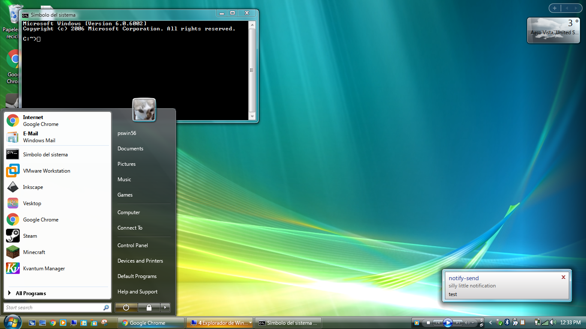
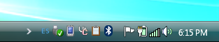
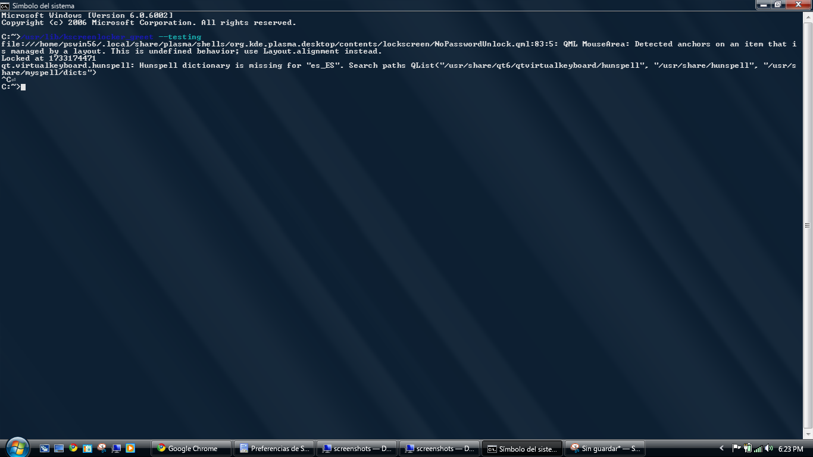

# VISTATHEMEPLASMA FOR KDE 6

## Microsoft® Windows™ is a registered trademark of Microsoft® Corporation. This name is used for referential use only, and does not aim to usurp copyrights from Microsoft. Microsoft Ⓒ 2025 All rights reserved. All resources belong to Microsoft Corporation.

## Introduction

This is a fork of [WackyIdeas](https://gitgud.io/wackyideas/)' [AeroThemePlasma](https://gitgud.io/wackyideas/aerothemeplasma) which aims to recreate the look and feel of Windows Vista as much as possible on KDE Plasma, whilst adapting the design to fit in with modern features provided by KDE Plasma and Linux.
It is still in heavy development and testing. VTP has been tested on:

1. Arch Linux x64 and other Arch derivatives
2. Plasma 6.3.1, KDE Frameworks 6.11.0, Qt 6.8.2
3. 96 DPI scaling, single monitor

See [INSTALL.md](./INSTALL.md) for a quick install guide.

For the sidebar gadgets, go [here](https://gitgud.io/catpswin56/win-gadgets).

## Credits 

Many thanks to the people who helped out by testing and providing some suggestions for certain plasmoids and other stuff. Special thanks goes to [WackyIdeas](https://gitgud.io/wackyideas/) for making the original [AeroThemePlasma](https://gitgud.io/wackyideas/aerothemeplasma) theme.

### VTP Credits

### Forked code

- blacklightpy's [PlymouthXP](https://github.com/blacklightpy/PlymouthXP) Plymouth theme

### Contributors

- [AngelBruni](https://github.com/angelbruni) for the SVG Vista taskbar texture
- [ThePhantom](https://github.com/ThePhantom6314) for remaking the task item textures and power button glyphs in SVG
- [aeoe](https://gitgud.io/aeoe) for fixing a minor issue with the VistaStart dialog texture
- [furkrn](https://gitgud.io/furkrn) for the Vista version of [PlymouthXP](https://github.com/blacklightpy/PlymouthXP)

### ATP Credits

### Forked code

- Intika's [Digital Clock Lite](https://store.kde.org/p/1225135/) plasmoid
- [Adhe](https://store.kde.org/p/1386465/), [oKcerG](https://github.com/oKcerG/QuickBehaviors) and [SnoutBug](https://store.kde.org/p/1720532) for making SevenStart possible
- Zren's [Win7 Show Desktop](https://store.kde.org/p/2151247) plasmoid
- [Mirko Gennari](https://store.kde.org/p/998614), DrGordBord and [bionegative](https://www.pling.com/p/998823) for making SevenBlack possible
- DrGordBord's [Windows 7 Kvantum](https://store.kde.org/p/1679903) theme
- [taj-ny](https://github.com/taj-ny)'s [kwin-effects-forceblur](https://github.com/taj-ny/kwin-effects-forceblur)

### Contributors

- [Souris-2d07](https://gitgud.io/souris) for making the following: 
    - Cursor theme
    - Plymouth theme 
    - SDDM theme
    - KWin decoration theme
    - Most KWin C++ effects
    - Other minor KWin features and scripts
- [That Linux Dude Dominic Hayes](https://github.com/dominichayesferen) for making the following: 
    - Lock screen UI 
    - Icon theme
- [QuinceTart10](https://github.com/QuinceTart10) for making the sound theme
- (In collaboration with) [kfh83](https://github.com/kfh83), [TorutheRedFox](https://github.com/TorutheRedFox) and [ALTaleX](https://github.com/ALTaleX531/dwm_colorization_calculator/blob/main/main.py) for figuring out accurate Aero glass blur and colorization effects
- [AngelBruni](https://github.com/angelbruni) for contributing several SVG textures, most notably the clock in DigitalClockLite Seven
- [ricewind012](https://github.com/ricewind012/) for .bashrc Microsoft Windows header

### Special Thanks 

- [MondySpartan](https://www.deviantart.com/mondyspartan/art/Windows-10-Year-2010-Edition-1016859431) for inspiring the notification design

### Very Cool projects that you should check out

- [Geckium](https://github.com/angelbruni/Geckium) by AngelBruni
- [Aero UserChrome](https://gitgud.io/souris/aero-userchrome) by Souris (Geckium in combination with Aero UserChrome works well with AeroThemePlasma)
- [AeroThemePlasma](https://gitgud.io/wackyideas/aerothemeplasma/) by WackyIdeas
- [Ice2K.sys](https://toiletflusher.neocities.org/ice2k/) by 0penrc

## Screenshots

### Desktop

### Start Menu

### Clock

### System Tray

### Notifications 

### Desktop Icons 

### Lockscreen 

### Alt-Tab Switcher

### Colorization 

### Decorations

### Firefox

### Taskbar

